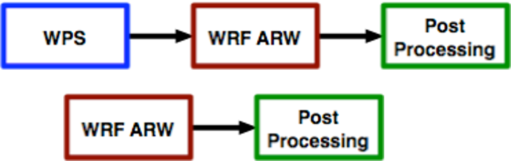
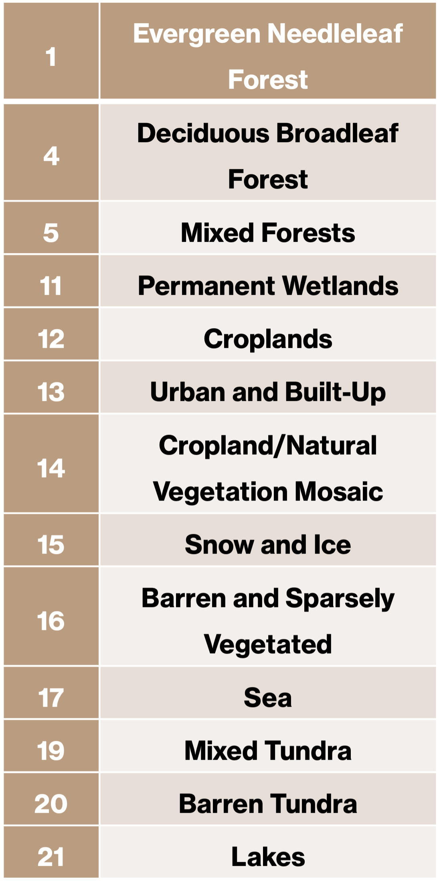
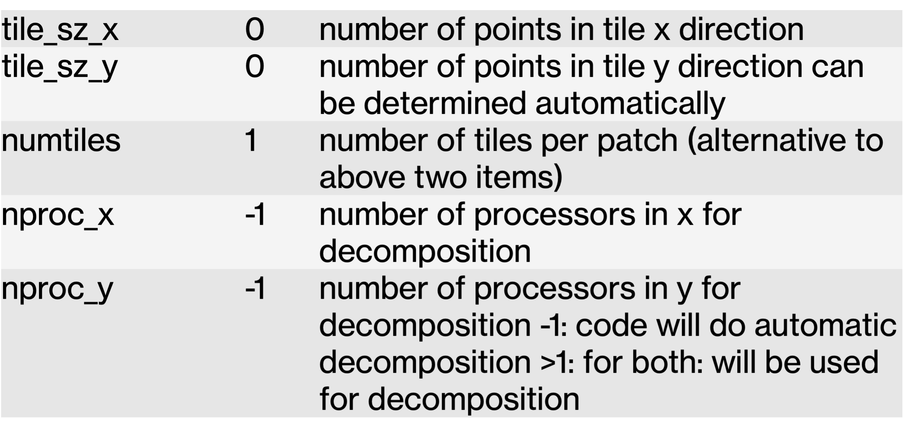

Köra WRF-modellen
=================

Arbetsgång
----------

Geografiskt område
------------------

.. figure:: images/LU.png
  :width: 400
  :alt: Landuse

Väderdata
---------

Exempel med 48-h prgnos från GFS
Sätt d till dagens datum, h till timme, och fh till prognoslängd i timmar.

for fh in {00..48..3}; do
	curl -s --disable-epsv --connect-timeout 	120 	-u anonymous:<epostadress> -o 	GFSd${d}_t${h}z_${fh} 	https://www.ftp.ncep.noaa.gov/data/nccf/com/gfs	/prod/gfs.202109${d}/${h}/atmos/gfs.t${h}z.pgrb	2.0p25.f0${fh}"
done

Namelist
--------

WPS och WRF har varsin fil, namelist, för att ställa in modellen.
Den läses in varje gång du startar modellen.
WPS
Tidsperiod, geografiskt område
Vilken geodata, vilken meteorologisk drivning, även is och SST
Domäner (behöver bara läsas när en domän skapas
WRF
Datum, och inputfiler område
Fysik, dynamik, uppdelning mellan processorer

Fysik
-----

Mikrofysik
New Thompson      Morrison double-moment 	WRF Double-Moment
Långvågsstrålning
RRTM 	RRTMG
Kortvågsstrålning 
Goddard shortwave	RRTMG
Ytskiktsfysik och PBL-fysik
Mm5	Eta	QNSE	MYNN		Yonsei 	MYJ
Markfysik
NOAH	RUC	NOAH-MP	CLM4
Cumulus-fysik    
Kain-Fritsch	Grell-Devenyi	Grell 3D
Urban                     

Välj fysik i namelist
#####################

mp_physics                          = 8,ra_lw_physics                       = 4,ra_sw_physics                       = 4,radt                                = 10,sf_sfclay_physics                   = 2,sf_surface_physics                  = 2,bl_pbl_physics                      = 2,bldt                                = 0,cu_physics                          = 0,
Varje siffra står för ett fysikschema
https://www2.mmm.ucar.edu/wrf/users/docs/user_guide_v4/v4.1/users_guide_chap5.html#Phys 

Parallelisering
---------------

**Domänuppdelning för processorerna i namelist**

