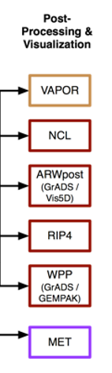

Analysera resultatet
====================

Resultatfiler är i netcdf-format
Rekommenderade analysprogram 
Något utdaterad lista.
NCL  wrf-python nu
Vissa svårigheter på Rpi med vissa bibliotek
Vapor är grafiskt användarvänlig. 
Kräver grafik-plugins, lite meckigt
Dålig koll på de andra programmen tyvärr
Jag har länge använt MATLAB
p.g.a. licens övergår jag stegvis till wrf-python

https://www2.mmm.ucar.edu/wrf/users/docs/user_guide_v4/v4.1/users_guide_chap9.html 

Bäst är att göra analysen på ditt kluster, så slipper du föra över filer till din laptop varje gång!
Vi kan dela med oss av analysskript!

Alternativ
----------

Textbaserade verktyg
NCO för netcdf-filerna
http://nco.sourceforge.net 
CDO för netcdf och GRIB-filerna
https://code.mpimet.mpg.de/projects/cdo/ 
T. ex. välj ut tidsperiod och spara i ny fil
Räkna på medelvärden etc…

Exempel
-------
