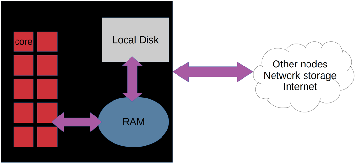
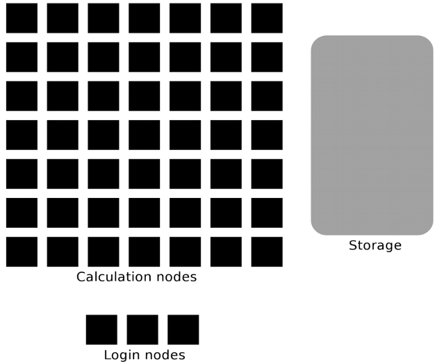
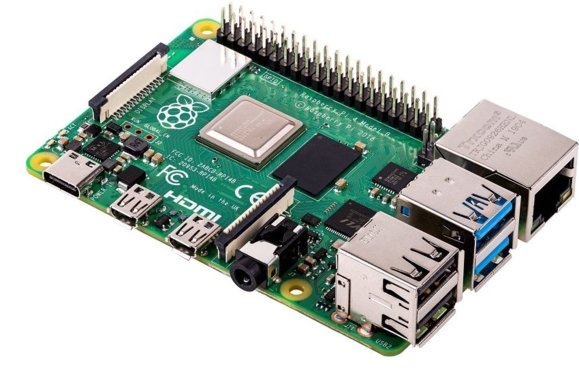

Datorer
=======

Vad gör egentligen en dator?
----------------------------

Datorn gör det vi ber den göra, men väldigt snabbt och bokstavligt.
Beräkna, styra, utföra…
Förstår bara ”maskinkod”
Vi skriver program som kan vara i olika språk:
C, C++
FORTRAN (WRF är skrivet nästan helt i det)
Dessa behöver kompileras till maskinkod 
 blir då mkt snabba
Finns även skriptspråk där vår kod tolkas direkt i en miljö
 blir långsammare
Ex: MATLAB, python, R, html, javascript, BASH

Vad är ett datorkluster?
------------------------

Ett (internt) nätverk av datorer.
Varje dator/moderkort fungerar som en "nod".

  
Varje nod innehåller flera processorkärnor 
gemensamt RAM-minne (finns lite olika alternativ där) och en lokal hårddisk.
Varje nod är ihopkopplade med nätverkskablar, t.ex. ethernet
via en central "switch" för att tillåta trafik åt båda hållen effektivt.
På beräkningsnoderna utförs de tunga beräkningarna.
Gemensam hårddisk.
Login-nod…
  
  

En login-nod, eller "Master" 
styra beräkningsnoderna. 
På "Mastern" kan man göra sitt eget arbete
analysera, flytta filer, fixa, 
medan beräkningsnoderna är upptagna med intensiva beräkningar.
Använda beräkningsnoderna
logga in på en beräkningsnod och kör.
använd en jobb-schemaläggare, t.ex. slurm

  

Från småskaligt Raspberry Pi-kluster...

.. figure:: images/RPI1.jpeg
  :width: 400
  :alt: Raspberry Pi-kluster

... till superdatorer som Nationellt SuperdatorCentrums (NSC) kluster Bi i Linköping där SMHI:s modeller körs.

.. figure:: images/rackham.png
  :width: 400
  :alt: Superdator
  Rackham-klusteret vid UPPMAX i Uppsala

Raspberry Pi
------------

Raspberry Pi 4 enkortsdator med ARM-arkitektur
EN sådan med 8 GB RAM (Quad-core 1,5 GHz) kan du få för cirka tusenlappen. 
Ingår 2 USB2 + 2 USB3 + 2 mini-HDMI till skärmar
Övriga attiraljer som switch, sladdar, SD-kort exklusive hårddisk hamnar nog på drygt tusenlappen också. 
Så ett kluster med fyra noder skulle gå på ca 5000 kr och öka med ca 1000 kr per nod tills du behöver köpa en större switch.
En hårddisk kanske du redan har. Annars är de ju billiga nu för tiden.

Kopplar upp trådlöst mot ”login-noden" från min Macs terminal 
secure shell (SSH). 
Mastern/Login i sin tur är ihopkopplade med beräkningsnoderna med korta ethernetsladdar. 

På detta system kör jag 
24 h-prognos 
9 km upplösning över 2/3 av Skandinavien (140×120 pkt) inklusive Ö. Svealand i 3 km (60×60).  Bild lite senare.
på ca 4 h. 

.. figure:: images/RPi_cluster_text
  :width: 400
  :alt: Mitt Raspberry Pi-kluster

Jämförelser
-----------

Rackham (UPPMAX)
Snowy (UPPMAX)
Bi (NSC
Purpose
General-purpose
General-purpose
SMHI and climate research
# Nodes
486
228-ish +
50 GPUs
641
Cores per node
20st @ 2.2 GHz
16st @ 2.2 GHz
16 at @ GHz
Memory/node
128 GB
128 GB
64 GB
Fat nodes
256GB & 1 TB
256, 512 GB & 4 TB
256 GB
Local disk (scratch)
2 TB
4 TB
420 GB
Login nodes
Yes
No (reached from Rackham)
Yes

LINUX
-----

Script
------

Parallellisering
---------------

SLURM
-----
