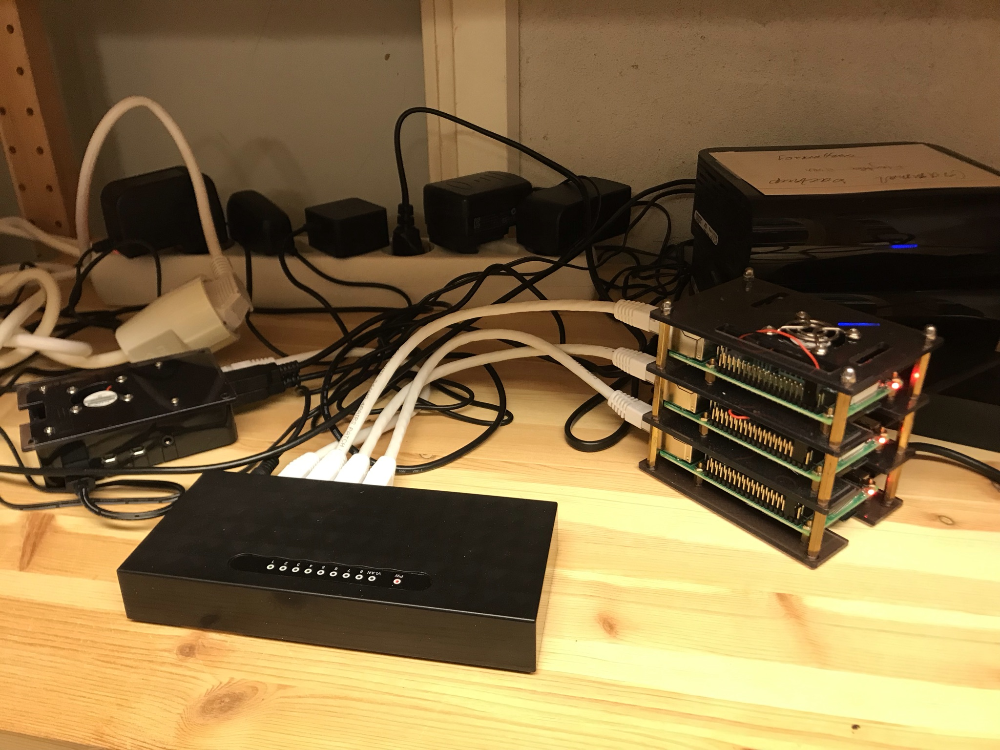

Utrustning
----------

En riktigt snabb dator
======================

Detta kan fungera hyfsat om man kör prognoser i litet område eller i 1-dimension. WRF-modellen kan då köras i så kallat ”shared-memory mode”. För en quad-core processor kan fyra kopior av programmet köras parallellt. Det geografiska området delas då in i fyra delområden.

Datorkluster
============

* Ett (internt) nätverk av datorer.
* Varje dator fungerar som en ”nod”.
* Från småskaligt Raspberry Pi-kluster…

  Mitt Raspberry Pi-kluster med tre beräkningsnoder till höger och en ”login”-nod till vänster. På detta system kör jag 24 h-prognos med 9 km upplösning över 2/3 av Skandinavien (140×120 pkt) inklusive Ö Svealand i 3 km (60×60) på ca 4 h.

.. figure:: ../images/RPI_o.jpeg
  :width: 400
  :alt: Raspberry Pi-kluster
  RaspBerry Pi 4 enkortsdator. EN sådan med 8 GB RAM (Quad-core 1,5 GHz) kan du få för knappa tusenlappen. Övriga attiraljer som switch, sladdar, SD-kort exklusive hårddisk hamnar nog på drygt tusenlappen också. Så ett kluster med fyra noder skulle gå på ca 5000 kr och öka med ca 1000 kr per nod tills du behöver köpa en större switch.

